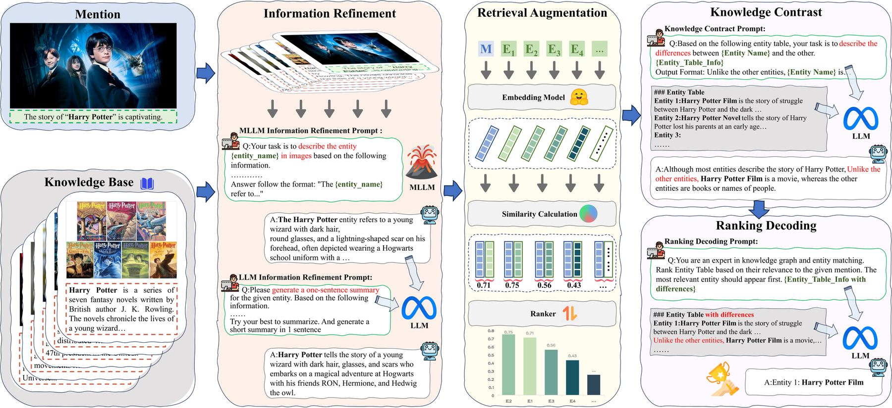

# RCMEL: A Multi-stage Framework for Multimodal Entity Linking

Official implementation of our paper on multimodal entity linking.

## 🧩 Architecture

The overall architecture of RCMEL is shown below.



## 🔍 Overview

RCMEL is a multi-stage multimodal entity linking framework built around retrieval, contrastive reasoning, and LLM-based decoding. The main idea is to enrich both entities and mentions with image-aware descriptions, retrieve candidate entities with dense representations, generate candidate-level knowledge contrast, and then use an LLM to produce the final ranking.


## ⚙️ Environment

 Create a conda environment and install the dependencies: The current codebase requires Python 3.10+ and uses vLLM in the main pipeline.

```bash
conda create -n RCMEL python=3.10
conda activate RCMEL
pip install -r requirements.txt
```

For different CUDA versions you need to install the corresponding PyTorch package. Find the appropriate installation package on the PyTorch website. To install PyTorch, we use the following command:

```bash
pip install torch==1.12.0+cu116 torchvision==0.13.0+cu116 torchaudio==0.12.0 --extra-index-url https://download.pytorch.org/whl/cu116
```


## 📦 Data

### Download

You may download **WikiMEL** and **RichpediaMEL** from [https://github.com/seukgcode/MELBench](https://github.com/seukgcode/MELBench) and **WikiDiverse** from [https://github.com/wangxw5/wikiDiverse](https://github.com/wangxw5/wikiDiverse).

Or download cleaned data from [https://github.com/pengfei-luo/MIMIC](https://github.com/pengfei-luo/MIMIC).


## 🚀 Usage

### Step 1: Configure paths and models

The main config files are:

- `config/wikidiverse.yaml`
- `config/wikidimel.yaml`

Before running experiments, please update:

- model paths for `llm`, `mllm`, and `embedding_model`
- service ports in `vllm.mllm.base_port` and `vllm.llm.base_port`


Example model fields in the current config:

```yaml
llm: "/home/xxx/models/meta-llama/Llama-3.1-8B-Instruct"
mllm: "/home/xxx/models/llava-hf/llava-v1.6-mistral-7b-hf"
embedding_model: "/home/xxx/models/Salesforce/SFR-Embedding-Mistral"
```

### Step 2: Run the pipeline

Run the following commands from the repository root.

#### 2.1 Entity augmentation

```bash
python src/main_entity.py config/wikidiverse.yaml
```

#### 2.2 Mention augmentation

```bash
python src/main_mention.py config/wikidiverse.yaml
```

#### 2.3 Dense retrieval

```bash
python src/main_top.py config/wikidiverse.yaml
```

#### 2.4 Knowledge contrast generation

```bash
python src/main_infer.py config/wikidiverse.yaml
```

#### 2.5 Final decoding

```bash
python src/main_decoding.py config/wikidiverse.yaml
```

To run WikiMEL experiments, replace the config path with `config/wikidimel.yaml`.

### Step 3: Evaluation

The repository includes `src/metric.py` for metric calculation.

Please note that `metric.py` currently uses a hard-coded input path, so you should modify it before evaluation.

## 📊 Results

Main experimental results from the paper are summarized below.

### Full Comparison Results

#### Text-only EL methods

| Model | WikiMEL H@1 | H@2 | H@3 | MR | MRR | WikiDiverse H@1 | H@2 | H@3 | MR | MRR | Avg. H@1 | Avg. MRR |
| --- | ---: | ---: | ---: | ---: | ---: | ---: | ---: | ---: | ---: | ---: | ---: | ---: |
| BERT | 39.95 | 53.68 | 61.31 | 6.36 | 54.07 | 57.08 | 74.57 | 84.32 | 2.12 | 72.03 | 48.52 | 63.05 |
| BLINK | 36.00 | 49.54 | 57.52 | 7.54 | 50.36 | 56.30 | 73.40 | 82.69 | 2.19 | 71.19 | 46.15 | 60.78 |
| GENRE | 60.10 | - | - | - | - | 78.00 | - | - | - | - | 69.05 | - |

#### RL-based methods

| Model | WikiMEL H@1 | H@2 | H@3 | MR | MRR | WikiDiverse H@1 | H@2 | H@3 | MR | MRR | Avg. H@1 | Avg. MRR |
| --- | ---: | ---: | ---: | ---: | ---: | ---: | ---: | ---: | ---: | ---: | ---: | ---: |
| GHMFC | 56.69 | 72.99 | 80.61 | 2.91 | 70.45 | 55.71 | 72.35 | 80.94 | 2.30 | 70.31 | 56.20 | 70.38 |
| DZMEND | 39.41 | 50.97 | 57.90 | 7.77 | 52.13 | 29.11 | 47.37 | 61.16 | 3.53 | 49.53 | 34.26 | 50.83 |
| JMEL | 47.99 | 63.60 | 71.68 | 4.33 | 62.42 | 51.55 | 68.08 | 78.49 | 2.47 | 67.15 | 49.77 | 64.79 |
| MEL-HI | 30.86 | 45.26 | 54.73 | 6.22 | 47.18 | 53.88 | 70.59 | 80.00 | 2.36 | 69.01 | 42.37 | 58.10 |
| DRIN | 66.05 | 79.81 | 85.39 | 2.11 | 80.84 | 49.43 | 66.90 | 77.17 | 1.83 | 57.21 | 57.74 | 69.02 |
| DWE | 72.80 | - | - | - | - | 51.20 | - | - | - | - | 62.00 | - |

#### VLP-based methods

| Model | WikiMEL H@1 | H@2 | H@3 | MR | MRR | WikiDiverse H@1 | H@2 | H@3 | MR | MRR | Avg. H@1 | Avg. MRR |
| --- | ---: | ---: | ---: | ---: | ---: | ---: | ---: | ---: | ---: | ---: | ---: | ---: |
| ViLT | 79.40 | 84.08 | 85.65 | 3.41 | 83.80 | 40.27 | 58.17 | 68.49 | 2.91 | 58.38 | 59.84 | 71.09 |
| ALBERT | 55.12 | 65.98 | 76.32 | 3.42 | 68.76 | 59.14 | 76.40 | 86.20 | 2.00 | 73.70 | 57.13 | 71.23 |
| CLIP | 81.53 | 89.97 | 93.15 | 1.78 | 87.89 | 61.12 | 79.70 | 89.16 | 1.88 | 75.61 | 71.33 | 81.75 |
| MMIC | 81.62 | 90.29 | 93.58 | 1.77 | 88.05 | 67.90 | 85.14 | 92.63 | 1.62 | 80.57 | 74.76 | 84.31 |

#### LLMs-based methods

| Model | WikiMEL H@1 | H@2 | H@3 | MR | MRR | WikiDiverse H@1 | H@2 | H@3 | MR | MRR | Avg. H@1 | Avg. MRR |
| --- | ---: | ---: | ---: | ---: | ---: | ---: | ---: | ---: | ---: | ---: | ---: | ---: |
| LLaMA3-8B | 74.12 | - | - | - | - | 71.10 | - | - | - | - | 72.61 | - |
| GPT-3.5 | 73.80 | - | - | - | - | 72.70 | - | - | - | - | 73.25 | - |
| GEMEL | 82.60 | - | - | - | - | 86.30 | - | - | - | - | 84.45 | - |
| FissFuse | 87.89 | 93.42 | 95.36 | 1.54 | 92.02 | 83.29 | 92.53 | 95.89 | 1.35 | 89.81 | 85.59 | 90.92 |

#### RCMEL (Ours)

| Model | WikiMEL H@1 | H@2 | H@3 | MR | MRR | WikiDiverse H@1 | H@2 | H@3 | MR | MRR | Avg. H@1 | Avg. MRR |
| --- | ---: | ---: | ---: | ---: | ---: | ---: | ---: | ---: | ---: | ---: | ---: | ---: |
| RCMEL (Ours) | 90.63 | 94.51 | 95.90 | 1.48 | 93.16 | 91.17 | 94.62 | 96.38 | 1.30 | 92.06 | 90.90 | 92.61 |


## 🗂️ Code Structure

```text
rcmel/
|-- config/
|   |-- wikidiverse.yaml
|   |-- wikidimel.yaml
|-- data/
|   |-- WikiDiverse/
|   |-- WikiMEL/
|-- src/
    |-- main_entity.py
    |-- main_mention.py
    |-- main_top.py
    |-- main_infer.py
    |-- main_decoding.py
    |-- entity_aug.py
    |-- mention_aug.py
    |-- embedding.py
    |-- infer.py
    |-- decoding.py
    |-- metric.py
    |-- util.py
    |-- wikidiverse.sh
```

## 📖 Citation

If you find this repository useful, please cite our paper.

```bibtex
@article{RCMEL: A Multi-stage Framework for Multimodal Entity Linking,
  title   = {TBA},
  author  = {TBA},
  journal = {TBA},
  year    = {TBA}
}
```

## ✉️ Contact

If you have any questions, please open an issue or contact the authors.
